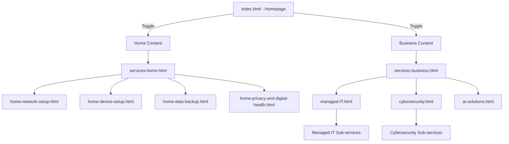
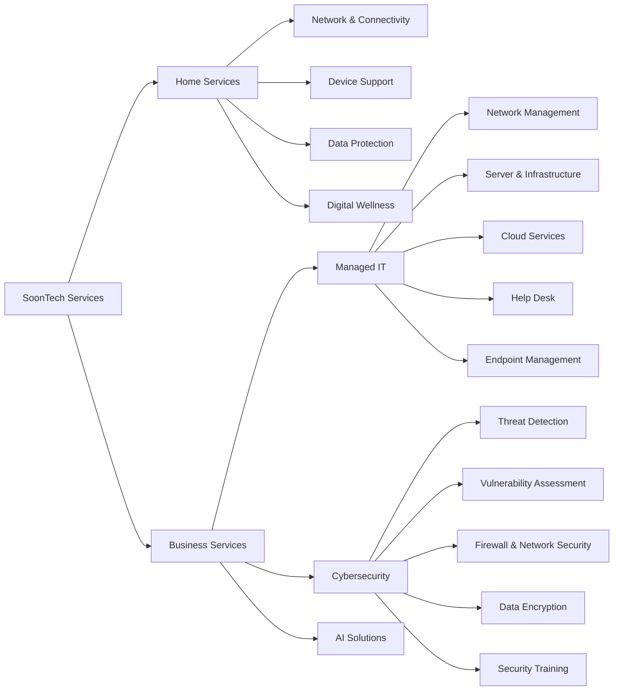

# SoonTech Website - Services Structure Documentation
## Operational Manual Reference

**Document Version:** 1.0  
**Last Updated:** January 23, 2026  
**Purpose:** Comprehensive documentation of SoonTech Website service structure for operational planning and management

---

## Table of Contents
1. [Overview](#overview)
2. [Service Architecture](#service-architecture)
3. [Home Services](#home-services)
4. [Business Services](#business-services)
5. [Page Structure & Navigation](#page-structure--navigation)
6. [Service Delivery Model](#service-delivery-model)
7. [Internationalization](#internationalization)

---

## Overview

SoonTech operates a **dual-market service model**, targeting both **Home/Consumer** and **Business/Enterprise** clients. The website architecture reflects this division with a toggle-based interface on the homepage and dedicated service pages for each market segment.

### Core Value Propositions

#### Home Market
- **Tagline:** "Tech Support That Feels Like Family"
- **Focus:** Personal, friendly IT support for families and individuals
- **Key Differentiators:** Same-day service, transparent pricing, patient support

#### Business Market
- **Tagline:** "Enterprise IT, Small Business Budget"
- **Focus:** Professional IT solutions with enterprise-grade quality at accessible prices
- **Key Differentiators:** 99.9% uptime, certified professionals, scalable solutions

---

## Service Architecture

The SoonTech service structure follows a **three-tier hierarchy**:

```
Level 1: Market Segment (Home / Business)
    │
    ├─ Level 2: Service Category
    │       │
    │       └─ Level 3: Specific Service Offerings
```

### Website Page Structure



---

## Home Services

### Service Category Overview

Home services are designed for **families and individuals** seeking simple, reliable technology support without technical jargon.

### 1. Home Network Setup and Security

**Primary Page:** [home-network-setup.html](file:///c:/Users/patri/Desktop/Soon-Tech/soontech/SoonTech-Website/src/home-network-setup.html)

**Service Description:** Reliable Wi-Fi coverage throughout the home with advanced security

**Key Features:**
- Blanket coverage with no dead zones
- Advanced security built-in
- Optimized for streaming and gaming

**Target Audience:** Homeowners experiencing Wi-Fi connectivity issues, smart home enthusiasts

---

### 2. Device Setup and Troubleshooting

**Primary Page:** [home-device-setup.html](file:///c:/Users/patri/Desktop/Soon-Tech/soontech/SoonTech-Website/src/home-device-setup.html)

**Service Description:** Expert setup and integration of personal devices

**Key Features:**
- Expert setup and optimization
- Smart home integration
- One-on-one training included

**Target Audience:** New device owners, smart home users, seniors needing tech assistance

---

### 3. Data Backup and Recovery

**Primary Page:** [home-data-backup.html](file:///c:/Users/patri/Desktop/Soon-Tech/soontech/SoonTech-Website/src/home-data-backup.html)

**Service Description:** Automated backup solutions for photos, files, and precious memories

**Key Features:**
- Set-and-forget automated backup
- Quick file recovery
- Access from any device

**Target Audience:** Families with important photos/videos, individuals concerned about data loss

---

### 4. Privacy and Digital Health Consultation

**Primary Page:** [home-privacy-and-digital-health.html](file:///c:/Users/patri/Desktop/Soon-Tech/soontech/SoonTech-Website/src/home-privacy-and-digital-health.html)

**Service Description:** Creating healthy online environments for families

**Key Features:**
- Smart parental controls
- Screen time balance guidance
- Online safety education

**Target Audience:** Parents, families with children, privacy-conscious individuals

---

### Additional Home Services (Listed on Homepage)

#### 5. Wi-Fi Setup & Optimization
- Fast, reliable internet throughout entire home
- Elimination of dead zones

#### 6. Smart Home Integration
- Device connectivity (Alexa, Google, etc.)
- Effortless control systems

#### 7. Home Network Security
- Protection from online threats
- Smart security solutions

#### 8. Photo & File Backup
- Automatic cloud and local backups
- Memory preservation

#### 9. New Device Setup
- Computer, tablet, phone configuration
- Day-one optimization

#### 10. 24/7 Tech Support
- Phone, email, remote assistance
- Always-available help

---

## Business Services

### Service Category Overview

Business services provide **enterprise-grade IT solutions** tailored for small to medium businesses, offering professional support at competitive prices.

---

## Business Service Categories

### Category 1: Managed IT Services

**Primary Page:** [managed-IT.html](file:///c:/Users/patri/Desktop/Soon-Tech/soontech/SoonTech-Website/src/managed-IT.html)

**Category Description:** Complete IT management, monitoring, and support for business operations

**Pricing Tiers:**
- **Basic Plan:** $199/month
- **Professional Plan:** $499/month
- **Enterprise Plan:** Custom Pricing

#### Sub-Services:

##### 1.1 Network Management
**Detail Page:** [business-MIT-network-management.html](file:///c:/Users/patri/Desktop/Soon-Tech/soontech/SoonTech-Website/src/business-MIT-network-management.html)

**Features:**
- Continuous monitoring to prevent downtime
- Advanced troubleshooting for network issues
- Custom network optimization and upgrades

---

##### 1.2 Server and Infrastructure Management
**Detail Page:** [business-MIT-server-and-infrastructure.html](file:///c:/Users/patri/Desktop/Soon-Tech/soontech/SoonTech-Website/src/business-MIT-server-and-infrastructure.html)

**Features:**
- 24/7 server monitoring and maintenance
- Optimized server performance for business continuity
- Secure data centers with backup and recovery

---

##### 1.3 Cloud Services and Virtualization
**Detail Page:** [business-MIT-cloud-services.html](file:///c:/Users/patri/Desktop/Soon-Tech/soontech/SoonTech-Website/src/business-MIT-cloud-services.html)

**Features:**
- Cloud migration and management
- Virtual server setup for cost savings
- Remote collaboration tools for seamless workflows

---

##### 1.4 Help Desk and Technical Support
**Detail Page:** [business-MIT-help-desk.html](file:///c:/Users/patri/Desktop/Soon-Tech/soontech/SoonTech-Website/src/business-MIT-help-desk.html)

**Features:**
- 24/7 help desk services
- Personalized troubleshooting and solutions
- Guidance on software, hardware, and system optimization

---

##### 1.5 Endpoint Management
**Detail Page:** [business-MIT-endpoint.html](file:///c:/Users/patri/Desktop/Soon-Tech/soontech/SoonTech-Website/src/business-MIT-endpoint.html)

**Features:**
- Real-time monitoring for all connected devices
- Automated updates and security patches
- Compliance management for remote and on-site teams

---

### Category 2: Cybersecurity Services

**Primary Page:** [cybersecurity.html](file:///c:/Users/patri/Desktop/Soon-Tech/soontech/SoonTech-Website/src/cybersecurity.html)

**Category Description:** Comprehensive security solutions to protect business data, systems, and reputation

**Pricing Tiers:**
- **Basic Plan:** $199/month
- **Professional Plan:** $499/month
- **Enterprise Plan:** Custom Pricing

#### Sub-Services:

##### 2.1 Threat Detection and Response
**Detail Page:** [business-cyber-threat-detection-and-response.html](file:///c:/Users/patri/Desktop/Soon-Tech/soontech/SoonTech-Website/src/business-cyber-threat-detection-and-response.html)

**Features:**
- Continuous monitoring to prevent security breaches
- Advanced threat detection systems
- Rapid incident response protocols

---

##### 2.2 Vulnerability Assessment and Penetration Testing
**Detail Page:** [business-cyber-vulnerability-assessment.html](file:///c:/Users/patri/Desktop/Soon-Tech/soontech/SoonTech-Website/src/business-cyber-vulnerability-assessment.html)

**Features:**
- Comprehensive security audits
- Penetration testing to identify weaknesses
- Detailed vulnerability reports with remediation plans

---

##### 2.3 Firewall and Network Security
**Detail Page:** [business-cyber-firewall-and-network-security.html](file:///c:/Users/patri/Desktop/Soon-Tech/soontech/SoonTech-Website/src/business-cyber-firewall-and-network-security.html)

**Features:**
- Enterprise-grade firewall configuration
- Network segmentation and access control
- Intrusion detection and prevention systems

---

##### 2.4 Data Encryption and Data Loss Prevention
**Detail Page:** [business-cyber-data-encryption.html](file:///c:/Users/patri/Desktop/Soon-Tech/soontech/SoonTech-Website/src/business-cyber-data-encryption.html)

**Features:**
- End-to-end data encryption
- Data loss prevention (DLP) strategies
- Secure data transmission protocols

---

##### 2.5 Security Awareness Training
**Detail Page:** [business-cyber-security-awareness.html](file:///c:/Users/patri/Desktop/Soon-Tech/soontech/SoonTech-Website/src/business-cyber-security-awareness.html)

**Features:**
- Employee security training programs
- Phishing simulation exercises
- Security best practices education

---

### Category 3: AI Solutions

**Primary Page:** [ai-solutions.html](file:///c:/Users/patri/Desktop/Soon-Tech/soontech/SoonTech-Website/src/ai-solutions.html)

**Category Description:** Cutting-edge artificial intelligence solutions for business automation and optimization

> **Note:** This is a newer service category. Detailed sub-services are under development.

---

### Additional Business Services (Listed on Homepage)

#### Cloud & Microsoft 365
- Seamless migration and management
- Microsoft 365, OneDrive, Teams deployment
- Email migration from any platform

#### Network Infrastructure
- Enterprise Wi-Fi installation
- Structured cabling and wiring
- Firewall and security configuration
- VPN and remote access setup

#### IT Strategy & Consulting
- Technology roadmaps aligned with business goals
- Strategic guidance from experts

#### Backup & Disaster Recovery
- Automated backup solutions
- Rapid recovery capabilities
- Business continuity planning

---

## Page Structure & Navigation

### Primary Navigation Pages

| Page | Purpose | Key Sections |
|------|---------|--------------|
| [index.html](file:///c:/Users/patri/Desktop/Soon-Tech/soontech/SoonTech-Website/src/index.html) | Homepage with Home/Business toggle | Hero, Services Grid, Why Choose Us, CTA |
| [services-home.html](file:///c:/Users/patri/Desktop/Soon-Tech/soontech/SoonTech-Website/src/services-home.html) | Home services overview | Service rows with details |
| [services-business.html](file:///c:/Users/patri/Desktop/Soon-Tech/soontech/SoonTech-Website/src/services-business.html) | Business services overview | Zig-zag service rows |
| [about-us.html](file:///c:/Users/patri/Desktop/Soon-Tech/soontech/SoonTech-Website/src/about-us.html) | Company information | Team, Mission, Values |
| [contact-us.html](file:///c:/Users/patri/Desktop/Soon-Tech/soontech/SoonTech-Website/src/contact-us.html) | Contact form and information | Contact form, location, hours |
| [support.html](file:///c:/Users/patri/Desktop/Soon-Tech/soontech/SoonTech-Website/src/support.html) | Support resources | FAQ, Contact options |
| [blog.html](file:///c:/Users/patri/Desktop/Soon-Tech/soontech/SoonTech-Website/src/blog.html) | Blog/insights | Articles, resources |

### Shared Components

- **[header.html](file:///c:/Users/patri/Desktop/Soon-Tech/soontech/SoonTech-Website/src/header.html):** Navigation bar (loaded via `includes.js`)
- **[footer.html](file:///c:/Users/patri/Desktop/Soon-Tech/soontech/SoonTech-Website/src/footer.html):** Footer with links and contact info (loaded via `includes.js`)

---

## Service Delivery Model

### Home Services Delivery

**Approach:** Personal, patient, family-friendly support

**Delivery Methods:**
- On-site home visits
- Remote assistance
- Phone and email support
- One-on-one training sessions

**Service Guarantees:**
- Same-day service available
- Transparent, upfront pricing
- No hidden fees
- Clear communication without jargon

---

### Business Services Delivery

**Approach:** Professional, enterprise-grade solutions with small business accessibility

**Delivery Methods:**
- Proactive monitoring (24/7)
- On-site and remote support
- Dedicated account management
- Strategic consulting sessions

**Service Guarantees:**
- 99.9% uptime guarantee
- Fast response times
- Certified professionals
- Scalable solutions

**Service Level Tiers:**
1. **Basic:** Entry-level support ($199/month)
2. **Professional:** Enhanced support and features ($499/month)
3. **Enterprise:** Custom solutions (Custom pricing)

---

## Internationalization

### Language Support

The website implements a **bilingual system** supporting:
- **English** (default)
- **Spanish** (Español)

### Implementation

**Translation System:** [i18n.js](file:///c:/Users/patri/Desktop/Soon-Tech/soontech/SoonTech-Website/src/i18n.js)

**Translation Files:**
- [translations/en.json](file:///c:/Users/patri/Desktop/Soon-Tech/soontech/SoonTech-Website/src/translations/en.json)
- [translations/es.json](file:///c:/Users/patri/Desktop/Soon-Tech/soontech/SoonTech-Website/src/translations/es.json)

**Translation Coverage:**
- All service descriptions
- Navigation elements
- Call-to-action buttons
- Hero sections
- Feature lists
- Contact forms

---

## Service Relationship Diagram



---

## Key Operational Insights

### Service Overlap & Cross-Selling Opportunities

Several services have natural synergies:

1. **Home Network Setup** ↔ **Smart Home Integration**
   - Customers setting up networks often need smart device integration

2. **Data Backup** ↔ **Privacy Consultation**
   - Data protection concerns align with privacy needs

3. **Managed IT** ↔ **Cybersecurity**
   - Business clients often need both infrastructure and security

4. **Cloud Services** ↔ **Backup & Disaster Recovery**
   - Cloud migration naturally includes backup solutions

### Target Market Segmentation

#### Home Market Personas
- **Young Families:** Smart home, parental controls, network setup
- **Seniors:** Device setup, patient training, ongoing support
- **Remote Workers:** Network optimization, security, backup

#### Business Market Personas
- **Startups (1-10 employees):** Basic managed IT, cloud migration
- **Small Business (10-50 employees):** Professional tier, cybersecurity
- **Growing Companies (50+ employees):** Enterprise solutions, full IT management

---

## Contact & Support Channels

### Customer Acquisition
- **Free Consultations:** Home services
- **Free Technology Assessment:** Business services

### Support Channels
- **24/7 Help Desk:** Business clients
- **Phone Support:** All clients
- **Email Support:** All clients
- **Remote Assistance:** All clients
- **On-site Visits:** Available for both markets

---

## Document Maintenance

### Update Schedule
- **Quarterly Review:** Service offerings and pricing
- **Bi-annual Review:** Market positioning and value propositions
- **Annual Review:** Complete service structure and delivery model

### Change Management
When adding new services:
1. Update this documentation
2. Create corresponding HTML pages
3. Update navigation and linking structure
4. Add translations to i18n files
5. Update service relationship diagrams

---

## Appendix: File Reference

### Service Pages by Category

**Home Services:**
- `home-network-setup.html`
- `home-device-setup.html`
- `home-data-backup.html`
- `home-privacy-and-digital-health.html`

**Business - Managed IT:**
- `managed-IT.html` (category page)
- `business-MIT-network-management.html`
- `business-MIT-server-and-infrastructure.html`
- `business-MIT-cloud-services.html`
- `business-MIT-help-desk.html`
- `business-MIT-endpoint.html`

**Business - Cybersecurity:**
- `cybersecurity.html` (category page)
- `business-cyber-threat-detection-and-response.html`
- `business-cyber-vulnerability-assessment.html`
- `business-cyber-firewall-and-network-security.html`
- `business-cyber-data-encryption.html`
- `business-cyber-security-awareness.html`

**Business - AI Solutions:**
- `ai-solutions.html`

---

**End of Document**

*For questions or updates to this documentation, contact the SoonTech web development team.*
